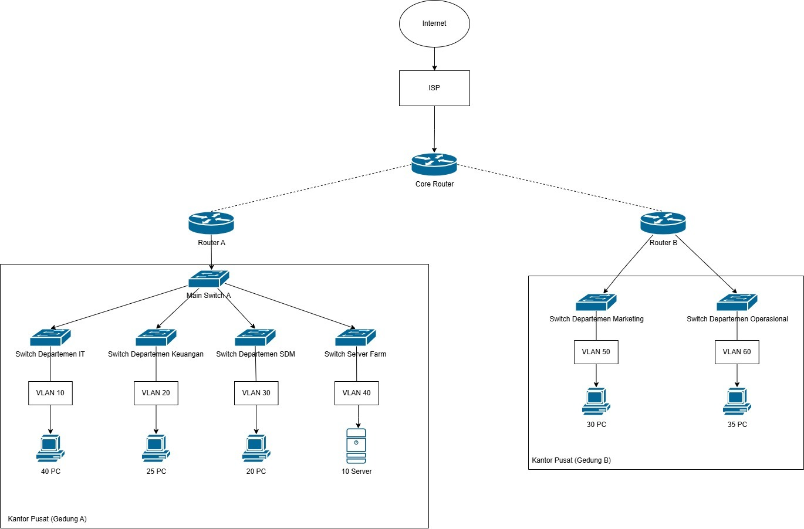

**Dokumen Desain Jaringan: Perancangan & Implementasi Jaringan Enterprise PT. Nusantara Network**

**Deliverable Pekan 10 - Mata Kuliah Desain & Manajemen Jaringan Komputer**

**Disusun oleh Kelompok 8:**

1.  **Adhitya Hermawan** - Network Architect
2.  **Achmad Zaki Zaidan** - Network Engineer
3.  **Amalia Tiara Rezfani** - Network Services Specialist
4.  **Faradila Zakiah Nur Hafitsa** - Security & Documentation Specialist

**Tanggal Pengumpulan:** Junat, [Pekan 10], [2025]

---

**Daftar Isi**

1.  Pendahuluan
    1.1. Latar Belakang Singkat
    1.2. Tujuan Dokumen
    1.3. Ruang Lingkup Desain
2.  Diagram Topologi Jaringan
    2.1. Diagram Topologi Fisik
    2.2. Diagram Topologi Logis (Termasuk VLAN & OSPF Areas)
3.  Skema Pengalamatan IP (Subnetting)
    3.1. Tabel Pengalamatan IP Rinci
4.  Rencana Penerapan VLAN
    4.1. Daftar VLAN dan Tujuannya
5.  Daftar Kebutuhan Perangkat
6.  Kesimpulan
7.  Lampiran (Jika ada - Misal: File diagram asli)

---

# 1. Pendahuluan

## 1.1. Latar Belakang Singkat
Dokumen ini disusun sebagai kelanjutan dari dokumen perencanaan proyek yang telah dibuat pada minggu ke-9. Berdasarkan hasil analisis kebutuhan infrastruktur jaringan di PT. Nusantara Network, fokus utama dari tahap ini adalah merancang secara komprehensif struktur jaringan, termasuk desain topologi akhir, perencanaan sistem pengalamatan IP yang efisien, serta strategi penerapan VLAN di dua lokasi fisik perusahaan, yakni Gedung A dan Gedung B. Perancangan ini dirancang untuk memastikan efisiensi operasional, skalabilitas jaringan, serta keamanan dan segmentasi lalu lintas data antar departemen.

## 1.2. Tujuan Dokumen
Dokumen ini disusun dengan tujuan sebagai berikut:

- Menyajikan desain akhir dari topologi jaringan, baik secara fisik maupun logis, untuk PT. Nusantara Network.
- Menjelaskan skema pengalamatan IP yang sistematis dan efisien, termasuk pembagian subnet untuk masing-masing VLAN dan koneksi antar router.
- Menguraikan rencana penerapan VLAN secara lengkap, mencakup ID, nama VLAN, serta fungsinya.
- Menyediakan daftar perangkat jaringan utama yang diperlukan beserta jumlahnya untuk merealisasikan desain dalam bentuk simulasi.

## 1.3. Ruang Lingkup Desain
Ruang lingkup dari desain ini meliputi:

- Infrastruktur jaringan inti (Core Router).
- Infrastruktur jaringan di Gedung A, mencakup Router A, access switch, dan VLAN 10, 20, 30, serta 40.
- Infrastruktur jaringan di Gedung B, mencakup Router B, access switch, serta VLAN 50 dan 60.
- Koneksi WAN antara Core Router, Router A, dan Router B.
- Akses ke jaringan Internet melalui penyedia layanan ISP.
- Pengalokasian alamat IP untuk setiap segmen jaringan dan perangkat utama.

---

# 2. Diagram Topologi Jaringan

*(Ilustrasi skematik awal topologi jaringan ditampilkan pada gambar di atas).*

## 2.1. Diagram Topologi Fisik

- **Internet Cloud:** Melambangkan jaringan publik/global (Internet) yang menyediakan akses eksternal bagi organisasi.
- **ISP:** Penyedia layanan internet (Internet Service Provider) yang menjadi jalur utama konektivitas internet bagi organisasi. Terhubung langsung ke **Core Router**.
- **Core Router:** Merupakan router pusat yang menjadi simpul penghubung antara jaringan ISP dan seluruh infrastruktur jaringan internal perusahaan. Core Router ini membagi koneksi ke dua router utama, yaitu:
  - **Router A** yang menangani Gedung A.
  - **Router B** yang menangani Gedung B.

### Gedung A (Kantor Pusat)

- **Router A:** Berfungsi sebagai gateway untuk seluruh jaringan di Gedung A. Terhubung ke Core Router melalui jalur WAN dan mengatur distribusi lalu lintas antar VLAN melalui **Main Switch A**.
- **Main Switch A:** Berperan sebagai switch utama yang meneruskan koneksi trunk dari Router A ke empat switch departemen di Gedung A, yaitu:
  - **Switch Departemen IT:** Melayani 40 PC yang tergabung dalam **VLAN 10**. Digunakan oleh unit Teknologi Informasi.
  - **Switch Departemen Keuangan:** Digunakan oleh 25 PC yang tergabung dalam **VLAN 20**, khusus untuk staf keuangan.
  - **Switch Departemen SDM:** Digunakan oleh 20 PC dalam **VLAN 30**, yang digunakan oleh tim Sumber Daya Manusia.
  - **Switch Server Farm:** Menangani 10 unit server yang tergabung dalam **VLAN 40**, seperti server database, DHCP, dan layanan internal lainnya.

### Gedung B (Kantor Pusat)

- **Router B:** Bertugas sebagai gateway untuk seluruh jaringan di Gedung B. Terhubung ke Core Router melalui jalur WAN dan menangani dua VLAN melalui dua switch berikut:
  - **Switch Departemen Marketing:** Menyediakan akses jaringan untuk 30 PC pada **VLAN 50**, khusus digunakan oleh divisi pemasaran.
  - **Switch Departemen Operasional:** Menyediakan akses untuk 35 PC yang tergabung dalam **VLAN 60**, digunakan oleh bagian operasional harian.

**2.2. Diagram Topologi Logis (Termasuk VLAN & OSPF Areas)**

*   **OSPF Area 0 (Backbone):** Mencakup `Core Router`, `Router A`, dan `Router B` beserta link interkoneksi antar ketiganya (Subnet `192.168.99.0/24`). `Core Router` akan menjadi pusat backbone.
*   **OSPF Area 1 (Gedung A):** Mencakup semua subnet yang terhubung langsung ke `Router A` (VLAN 10, 20, 30, 40). `Router A` akan bertindak sebagai Area Border Router (ABR) antara Area 0 dan Area 1.
    *   VLAN 10: Subnet `192.168.10.0/24`
    *   VLAN 20: Subnet `192.168.20.0/24`
    *   VLAN 30: Subnet `192.168.30.0/24`
    *   VLAN 40: Subnet `192.168.40.0/24`
*   **OSPF Area 2 (Gedung B):** Mencakup semua subnet yang terhubung langsung ke `Router B` (VLAN 50, 60). `Router B` akan bertindak sebagai Area Border Router (ABR) antara Area 0 dan Area 2.
    *   VLAN 50: Subnet `192.168.50.0/24`
    *   VLAN 60: Subnet `192.168.60.0/24`
*   **NAT Boundary:** Terletak di `Core Router`, mentranslasikan alamat dari semua subnet internal (`192.168.10.0/24` - `192.168.60.0/24`) ke alamat IP publik pada interface WAN (`203.0.113.1`).
*   **Inter-VLAN Routing:** Dilakukan oleh `Router A` untuk VLAN di Gedung A dan oleh `Router B` untuk VLAN di Gedung B (menggunakan sub-interface pada koneksi trunk ke switch).
*   **DHCP/DNS Server:** Berlokasi di VLAN 40 (Server Farm) dengan alamat IP statis (`192.168.13.10` untuk DHCP/DNS). `Router A` dan `Router B` akan dikonfigurasi sebagai DHCP Relay Agent (ip helper-address) untuk meneruskan request DHCP dari VLAN lain ke server ini.

---

**3. Skema Pengalamatan IP (Subnetting)**

**3.1. Tabel Pengalamatan IP Rinci**

| Lokasi        | Tujuan / VLAN Name | VLAN ID | Network Address | Prefix Length | Subnet Mask     | Gateway Address (Router Interface) | Usable IP Range (DHCP/Static)         | Broadcast Address  | Notes                                               |
|---------------|--------------------|---------|------------------|----------------|------------------|--------------------------------------|-----------------------------------------|---------------------|---------------------------------------------------------|
| Kantor Pusat  | VLAN_IT            | 10      | 192.168.10.0     | /24            | 255.255.255.0    | 192.168.10.1                         | 192.168.10.2 – 192.168.10.254           | 192.168.10.255     | Untuk Departemen IT                                 |
| Kantor Pusat  | VLAN_KEU           | 20      | 192.168.20.0     | /24            | 255.255.255.0    | 192.168.20.1                         | 192.168.20.2 – 192.168.20.254           | 192.168.20.255     | Untuk Departemen Keuangan                          |
| Kantor Pusat  | VLAN_SDM           | 30      | 192.168.30.0     | /24            | 255.255.255.0    | 192.168.30.1                         | 192.168.30.2 – 192.168.30.254           | 192.168.30.255     | Untuk Departemen SDM                               |
| Kantor Pusat  | VLAN_SERVER        | 40      | 192.168.40.0     | /24            | 255.255.255.0    | 192.168.40.1                         | 192.168.40.2 – 192.168.40.254           | 192.168.40.255     | Server Farm (DNS, DHCP, Web)                       |
| Kantor Cabang | VLAN_MKT           | 50      | 192.168.50.0     | /24            | 255.255.255.0    | 192.168.50.1                         | 192.168.50.2 – 192.168.50.254           | 192.168.50.255     | Untuk Departemen Marketing                         |
| Kantor Cabang | VLAN_OPS           | 60      | 192.168.60.0     | /24            | 255.255.255.0    | 192.168.60.1                         | 192.168.60.2 – 192.168.60.254           | 192.168.60.255     | Untuk Departemen Operasional                       |
| Backbone      | VLAN_MGMT          | 99      | 192.168.99.0     | /24            | 255.255.255.0    | 192.168.99.1                         | 192.168.99.2 – 192.168.99.254           | 192.168.99.255     | Interkoneksi router OSPF dan manajemen jaringan    |

*Noted: Alamat gateway untuk masing-masing VLAN dikonfigurasi melalui sub-interface pada router terkait, misalnya GigabitEthernet0/0.10 untuk VLAN 10.*

---

**4. Rencana Penerapan VLAN**

**4.1. Daftar VLAN dan Tujuannya**

| VLAN ID | VLAN Name        | Lokasi       | Departemen/Tujuan      | Subnet IP Assigned | Default Gateway |
| :------ | :--------------- | :----------- | :--------------------- | :----------------- | :-------------- |
| 10      | VLAN_IT          | Kantor Pusat | Departemen IT          | 192.168.10.0/24    | 192.168.10.1    |
| 20      | VLAN_KEU         | Kantor Pusat | Departemen Keuangan    | 192.168.20.0/24    | 192.168.20.1    |
| 30      | VLAN_SDM         | Kantor Pusat | Departemen SDM         | 192.168.30.0/24    | 192.168.30.1    |
| 40      | VLAN_SERVER      | Kantor Pusat | Server Internal         | 192.168.40.0/24    | 192.168.40.1    |
| 50      | VLAN_MKT         | Kantor Cabang| Departemen Marketing   | 192.168.50.0/24    | 192.168.50.1    |
| 60      | VLAN_OPS         | Kantor Cabang| Departemen Operasional | 192.168.60.0/24    | 192.168.60.1    |
| 99      | VLAN_MGMT        | Semua Lokasi | Management / Backbone   | 192.168.99.0/24    | 192.168.99.1    |

**5. Daftar Kebutuhan Perangkat (Untuk Simulasi)**

| **Perangkat**           | **Model (Contoh)**     | **Jumlah** | **Lokasi/Peran**                  | **Keterangan**                      |
|------------------------|------------------------|------------|-----------------------------------|-------------------------------------|
| Router                 | Cisco 1941/2911        | 3          | Core, Router A, Router B          | OSPF, NAT, DHCP Relay               |
| Switch Layer 2         | Cisco 2960             | 6          | Gedung A (4), Gedung B (2)        | VLAN, Trunk                         |
| Server                 | Generic Server         | 1          | Server Farm (VLAN 40)             | DHCP & DNS - IP: 192.168.13.10      |
| PC/Workstation         | Generic PC             | 60+        | Klien tiap departemen             | Uji konektivitas & layanan jaringan|
| ISP Router (Simulasi)  | Generic Router         | 1          | Gateway ke Internet               | Koneksi WAN                         |

*Catatan: Angka yang tercantum untuk jumlah PC/Workstation hanya digunakan sebagai representasi untuk keperluan simulasi dan pengujian, dan tidak mencerminkan jumlah yang sebenarnya di implementasi asli.*

**6. Kesimpulan**

Dokumen ini menyajikan desain jaringan komprehensif untuk PT. Nusantara Network, mencakup topologi fisik dan logis, skema pengalamatan IP, serta rencana penerapan VLAN. Desain ini bertujuan menciptakan infrastruktur jaringan yang efisien, scalable, dan tersegmentasi, dengan OSPF sebagai protokol routing untuk mendukung komunikasi antar departemen dan pengelolaan lalu lintas data.

Sebagai dasar untuk konfigurasi perangkat jaringan (Router dan Switch) pada Pekan 11 dan seterusnya, penerapan OSPF multi-area dan penempatan layanan utama (DHCP/DNS) di Server Farm diharapkan memenuhi kebutuhan skalabilitas dan fungsionalitas perusahaan. Implementasi desain ini diharapkan dapat meningkatkan produktivitas dan efisiensi operasional, serta memberikan fondasi yang kuat untuk pengembangan jaringan di masa depan, dengan keberhasilan yang bergantung pada pemantauan dan pemeliharaan yang berkelanjutan.

**7. Lampiran**

*   [(Link ke file .pkt)](https://github.com/ZakiZaidan/Kelompok-8-DMJK/blob/aa95625a5f6b56b9a4e30cb5f77c96b5f0a38c21/file%20.pkt/Topologi_UAS_Minggu10.pkt)

---